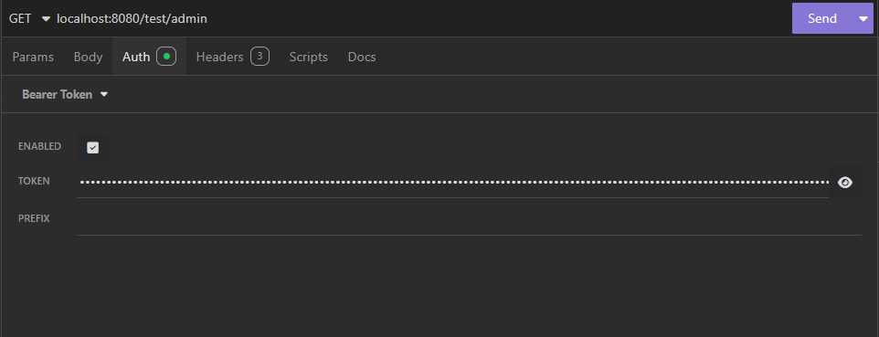

# Spring Security JWT Auth Template
This project is a **Spring Boot authentication template** using **JWT (JSON Web Token)** and **Spring Security 6+**.  
It provides a modern, stateless authentication system with role-based access control (RBAC) and a configurable role hierarchy (`ROLE_ADMIN > ROLE_USER`).

---
##  Features

- **JWT Authentication** (login and token validation)
- **Role hierarchy** (`ROLE_ADMIN` inherits `ROLE_USER`)
- **Custom security filter** (`OncePerRequestFilter`) for token validation
- **Stateless session policy**
- **Password encryption** with BCrypt
- **Simple and clean architecture** (Controller → Service → Repository)
- **Ready for API testing** with Postman or Curl
- Access permissions can be configured either through the **SecurityConfigurations class** or by using the `@PreAuthorize("hasRole('ROLE')")` annotation. 
---
##  Tech Stack

| Technology | Purpose |
|-------------|----------|
| **Java 21+** | Main language |
| **Spring Boot 3+** | Application framework |
| **Spring Security 6+** | Authentication and authorization |
| **JWT (com.auth0:java-jwt)** | Token management |
| **Maven** | Dependency management |
| **H2 / PostgreSQL (optional)** | Database support |
| **BCrypt** | Password hashing |
---

## Project Structure
``` 
src/main/java/com/dev/arthur/springsecurity_jwt_auth/
│
├── config/
│ └── SecurityConfigurations.java # Security filter chain and role hierarchy
│
├── controllers/
├── auth/
│ │  └── AuthController.java # Handles login and registration
│ ├── ProductController.java # Handles products endpoints (for tests pourposes)
│ └── RoleTestController.java # Handles roles endpoints tests to better understand the Hierarchy
│
├── entities/
├── dtos/
│    └── # DTOs for authorizations, registers, responses
├── enums/
│ │  └── UserRole.java # Enum representing roles
│ ├── User.java # Entity representing application users
│ └── Product.java # Entity representing application products
│
├── repositories/
│ ├── UserRepository.java # JPA repository for users
│ └── ProductRepository.java # JPA repository for products
│
├── security/
│ ├── SecurityConfigurations.java # Spring security configurations
│ └── SecurityFilter.java # Custom JWT validation filter
│
└── services/
├── auth/
│ ├── AuthService.java # Loads user details
│ └── TokenService.java # Generates and validates JWTs
└── ProductService.java # Product logic
```
--- 
##  Authentication Flow
### 1. **Register a new user**
`POST /auth/register`
```json
{
"username": "admin",
"password": "1234",
"role": "ROLE_ADMIN"
}
```
### 2. Login to get a JWT
`POST /auth/login`
```json
{
"username": "admin",
"password": "1234",
}
```
### **Response:**
```json
{
  "token": "eyJhbGciOiJIUzI1NiIsInR5..."
}
```
### 3. Access protected routes
Add the token to the Authorization header:

---
# Role Hierarchy

## The project defines:

`ROLE_ADMIN > ROLE_USER`

### That means:

- `ROLE_ADMIN` can access endpoints restricted to both ROLE_ADMIN and ROLE_USER.

- `ROLE_USER` can only access endpoints requiring ROLE_USER.

You can modify this behavior in:
```java
// SecurityConfiguration.java
@Bean
public RoleHierarchy roleHierarchy() {
    return RoleHierarchyImpl.fromHierarchy("ROLE_ADMIN > ROLE_USER");
}
```
---
# Example Protected Endpoints
## Using annotations
```java
@RestController
@RequestMapping("/test")
public class RoleTestController {

    @GetMapping("/admin")
    @PreAuthorize("hasRole('ADMIN')")
    public String adminOnly() {
        return "Access granted for ADMIN";
    }

    @GetMapping("/user")
    @PreAuthorize("hasRole('USER')")
    public String userOnly() {
        return "Access granted for USER";
    }
}
```
## Using the config class
```java
    @Bean
    public SecurityFilterChain securityFilterChain(HttpSecurity httpSecurity) throws Exception {
        return httpSecurity.csrf(AbstractHttpConfigurer::disable).sessionManagement(session -> session.sessionCreationPolicy(SessionCreationPolicy.STATELESS)) // define as configurações como STATELESS
                .authorizeHttpRequests(authorize -> authorize
                        .requestMatchers(HttpMethod.POST, "/products").hasRole("ADMIN") // Only ADMINS can access it
                        .requestMatchers(HttpMethod.POST, "/auth/login").permitAll() // No permissions requires
                        .requestMatchers(HttpMethod.POST, "/auth/register").permitAll() // UNSAFE -> for tests only
                        .anyRequest().authenticated()) // Every other request needs to be authenticated
                .addFilterBefore(securityFilter, UsernamePasswordAuthenticationFilter.class) // Applies the filter
                .build();
    }
```
---
# Configuration
### In your `.env` or `application.properties`:

`api.security.token.secret=${JWT_SECRET:default-secret-key}`

---
# License
This project is distributed under the MIT License.

Feel free to use and modify it for your own learning or production projects.


